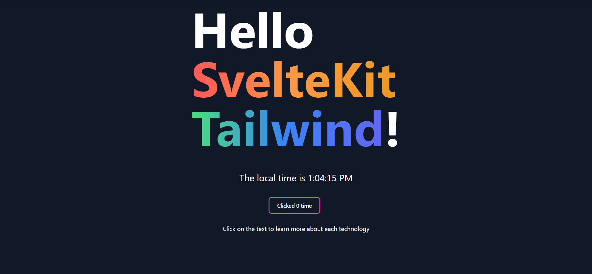

# SvelteKit-Template

This template was made specifically for the purpose of having Tailwind and Typescript in a SvelteKit server setup. It is definitely opinionated but only limited to those 3 features. The template itself will be very flexible and can be used unto a wide range of projects.
Here are the opinionated aspects:

-   Svelte
-   SvelteKit
-   TypeScript
-   Tailwind
-   Vercel (SvelteKit Adapter | Easily Changeable)
-   PNPM



## Creating a project

If you're seeing this, you've probably already done this step. Congrats!

```bash
# create a new project in the current directory
npx degit JoshQuaintance/SvelteKit-Template

# create a new project in my-app
npx degit JoshQuaintance/SvelteKit-Template
```

> Note: `degit` will ask to install itself to run the command, agree to it

## Developing

Once you've created a project and installed dependencies with `pnpm install` (or `npm install`, preferably use pnpm), start a development server:

```bash
pnpm run dev

# or start the server and open the app in a new browser tab
pnpm run dev -- --open
```

When you run it for the first time, the website should look like the image above.

## Building

Before creating a production version of your app, install an [adapter](https://kit.svelte.dev/docs#adapters) for your target environment. The default pre-installed and used adapter on this template is the Vercel template.

Then:

```bash
pnpm run build
```

> You can preview the built app with `pnpm run preview`, regardless of whether you installed an adapter. This should _not_ be used to serve your app in production.
