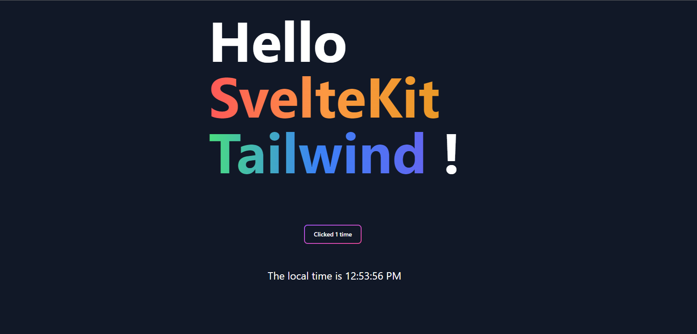

# SvelteKit Template

A SvelteKit template with Tailwind integrated with a purpose of being flexible. The template itself can be used in a whole wide range of projects and I personally have.

Since SvelteKit is still in development, there will be ne changes coming to the template. The last major update has prompted the rebuild of the template following some of the new standards of SvelteKit

> _Note: This is an opinionated template, everything will be according to my liking, but to the nature of the flexibility of the template, it shouldn't take much to configure it to one's own liking_
>
> This is a part of the rebuilt template, if the legacy template is required,
> there is a branch called `legacy` in the GitHub repository,
> just simply clone that branch
> (I will try to update it but if an issue comes up, simply create an issue in GitHub)



## What's in the box

Here is the list of technologies that are used in this template

---

#### [SvelteKit](https://kit.svelte.dev)

SvelteKit is a framework for building web applications of all sizes, with a beautiful development experience and flexible filesystem-based routing.

---

#### [Typescript](https://www.typescriptlang.org/)

TypeScript is a strongly typed programming language that builds on JavaScript, giving you better tooling at any scale.

---

#### [Tailwind](https://tailwindcss.com/)

A utility-first CSS framework packed with classes like flex, pt-4, text-center and rotate-90 that can be composed to build any design, directly in your markup.

---

#### [PNPM](https://pnpm.io/)

Fast, disk space efficient package manager

---

#### [husky](https://typicode.github.io/husky/#/)

Modern native git hooks made easy

---

#### [ESLint](https://eslint.org/)

ESLint statically analyzes your code to quickly find problems.

---

#### [Prettier](https://prettier.io/)

An opinionated code formatter

---

#### [Playwright](https://playwright.dev/)

Playwright enables reliable end-to-end testing for modern web apps.

---

#### [Vitest](https://vitest.dev/)

A Vite-native unit test framework. It's fast!

---

There are also recommended workspace extensions for Visual Studio Code

## Creating a Project

If you're seeing this, you've probably already done this step. Congrats!

If not, then follow these steps:

```bash
# create a new project in the current directory
pnpm dlx degit JoshQuaintance/SvelteKit-Template

# create a new project in my-new-app
npx degit JoshQuaintance/SvelteKit-Template my-new-app
# you can change 'my-new-app' into whatever your project name would be
```

> Note: if `degit` ask to install itself to run the command, agree to it

## Pre-Development

Before developing, there are some housekeeping to be done.

##### 1. Install Packages

To install all the necessary packages, simply run

```bash
pnpm install
```

This should install all the packages and create a `pnpm-lock.yaml`.

> Note: Make sure you are running pnpm 7 or above and node 16 or above
>
> Be careful, because this lock file will be specifically for the device it was installed on.  
> If there is an error trying to install, delete the `pnpm-lock.yaml` file

##### 2. Setup Husky

If this project was created using `degit`, then husky will not work until a git repository is initialized. Most code editor will have a git integration that will let you initialize a repository, but if not:

```bash
# initialize git into this repository
git init
```

If the project is created from cloning the repository itself, then husky should be setup!

##### 3. Setup Playwright

Lastly, we need to make sure playwright is installed so it can run the playwright tests. Make sure you have done step 1

```bash
# This will install playwright
pnpm exec playwright install
```

After all of that is done, then you are ready to develop!

## Developing

To start a development server run:

```bash
# Runs a dev server (defaults at port 5173)
pnpm run dev

# or start the server and open the app in a new browser tab
pnpm run dev --open
```

When you run it for the first time, the website should look like the image above.

And now, try editing the files and see how it changes on the browser. It should automatically reloads.

## Testing

This template has Playwright and Vitest built-in that can be utilized.
Here are the scripts that runs the tests

```bash
# Runs all the test
pnpm run test:all

# Runs all playwright test (end-to-end and component)
pnpm run test:playwright

# Runs playwright component test (experimental)
pnpm run test:com

# Runs playwright end-to-end test
pnpm run test:e2e

# Runs vitest unit test
pnpm run test:unit

# Runs vitest unit test on watch
pnpm run test:unit-watch
```

> Note: Building and running a git commit on the project will trigger the execution for the `test:all`

## Building

Building the project will trigger the `test:all` to make sure there isn't any errors. Then it will build the project using the svelte adapter.

The default adapter is the `@sveltejs/adapter-auto` but it is recommended to install the correct adapter for your project. Refer to https://github.com/sveltejs/kit#packages.

Then after the desired adapter is install, edit `svelte.config.js`:

```ts
// svelte.config.js

// change this import into the adapter
import adapter from '@sveltejs/adapter-auto';
```

then run:

```bash
# Builds the project
pnpm run build
```

You can also optionally run

```bash
# Runs a server to preview the build
pnpm run preview
```
